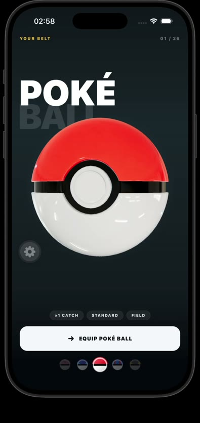

# Choose Your Ball

A polished, standalone React Native showcase extracted from the Pokémon Card capture experience. It preserves the original art direction, interaction formulas, and 26-ball catalog while rendering the hero ball with [`react-native-filament`](https://github.com/margelo/react-native-filament).

The original `pokemon-card` project remains on its Three.js/WebGPU renderer. This repository is the separate Filament implementation intended for client review.

## Showcase

<p align="center">
  <a href="./media/choose-your-ball-showcase.mp4">
    
  </a>
</p>

<p align="center">
  <a href="./media/choose-your-ball-showcase.mp4"><strong>▶ Watch the 60-second showcase</strong></a>
  ·
  <a href="https://x.com/TrninhHuy1/status/2084748199903011268">View the original post on X ↗</a>
</p>

The showcase demonstrates the full selection loop: horizontal swipe and thumbnail navigation, spring-settled transitions, complete shell rotation, vertical free-look, and glossy HDR material response across the ball catalog.

## What is included

- All 26 catalog balls in the original loop order.
- Horizontal swipe, thumbnail selection, spring landing, full-shell turn, and vertical free-look tilt.
- The original GLB geometry and exact Great / Ultra / Master artist-authored mesh markings.
- Procedural shell masks for Dusk, Repeat, Heal, and the remaining catalog variants.
- A preloaded texture bank so selection never waits for an asset during motion.
- The original RGBE warehouse environment baked to Filament KTX IBL for glossy HDR reflections.
- Reduced Motion support and the original responsive layout formulas.

## Run locally

```bash
npm install
npx expo prebuild --clean --platform ios
npm run ios
```

The project uses Expo SDK 57, React Native 0.86, React 19.2, Reanimated 4.5, and React Native Filament 1.11.

## Quality gates

```bash
npm test
npm run typecheck
npm run lint
npm run format:check
npx expo export --platform ios
```

The parity tests lock the copied Three.js product assets/components by SHA-256, verify the eight GLB entities and independent Filament material slots, and reject legacy Three.js/WebGPU imports from the new renderer.

## Asset pipeline

Generated assets are committed so a reviewer does not need Filament tooling to run the app.

```bash
# Give every GLB mesh an independent glTF material and texture capability.
npm run bake:filament-ball

# Bake the 26 shell paint textures and regenerate the static preload hook.
npm run bake:filament-shells

# Rebuild the HDR warehouse IBL. Filament 1.68.3 matches RNF 1.11's submodule.
CMGEN_BIN=/path/to/filament/bin/cmgen npm run bake:filament-environment
```

`warehouse.png` stores Radiance RGBE data: RGB contains mantissas and alpha contains the shared exponent. The environment script reconstructs the HDR stream before calling `cmgen`; treating it as an ordinary PNG destroys the highlight range and makes the ball look flat. It also flips the equirectangular rows and applies the 180-degree yaw required to preserve the original Three/PMREM room orientation in Filament, keeping the photographed softbox reflections on the same parts of the shell.

## Key files

- `App.tsx` — standalone screen composition.
- `src/components/poc/capture/BallStage3D.tsx` — Filament scene, camera, lights, IBL, model, and worklet motion.
- `src/components/poc/capture/ballFilamentSurface.ts` — renderer-neutral surface and marking parity rules.
- `src/components/poc/capture/useChooseBallCarousel.ts` — carousel gesture and spring state.
- `scripts/` — reproducible GLB, shell texture, and environment bakes.

The warehouse environment is based on Poly Haven's CC0 `empty_warehouse_01_1k` asset.
